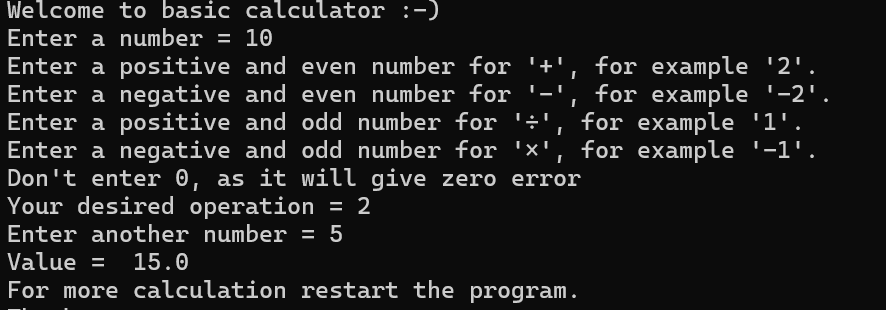
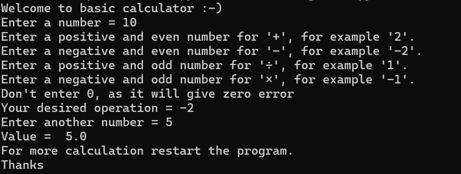
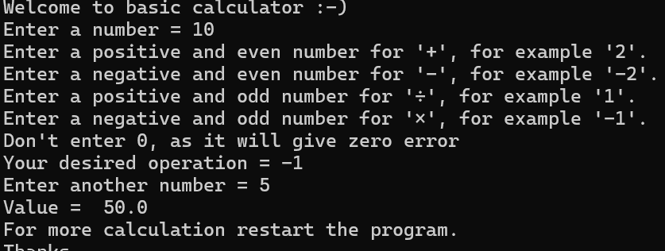
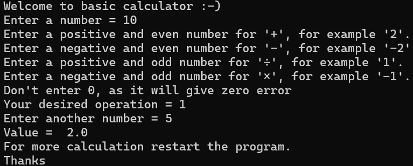

# Branchless Calculator

A Python calculator that performs addition, subtraction, multiplication, and division without using "if", "elif", "else", "match-case", or other conditional operation-selection structures.

## Concept

Instead of selecting operations through conditional statements, the calculator classifies any non-zero integer according to two mathematical properties:

- Sign (positive or negative)
- Parity (odd or even)

The combination of these properties determines which operation is performed.

## Operation Classification

|Integer Type| Operation|
|------------|----------|
|Positive Even| Addition|
|Negative Even| Subtraction|
|Positive Odd| Multiplication|
|Negative Odd| Division|

### 0 is invalid and must not be entered.

## Examples of Valid Inputs

### Addition:

- 2, 4, 6, 8, 100, ...

### Subtraction:

- -2, -4, -6, -8, -100, ...

### Multiplication:

- 1, 3, 5, 7, 99, ...

### Division:

- -1, -3, -5, -7, -99, ...

This means there are infinitely many valid operation values rather than a fixed set of operation codes.

## Features

- Branchless operation selection
- Infinite valid operation values
- Uses mathematical classification instead of direct operator selection
- Constant time complexity: O(1)
- Constant space complexity: O(1)
- Original student project

## Example

Input:
A = 10

B = 6

C = 5

Output:
15

Since 6 is a positive even integer, the calculator performs addition.

## Screenshots

## Author

### Prakhar Srivastava
